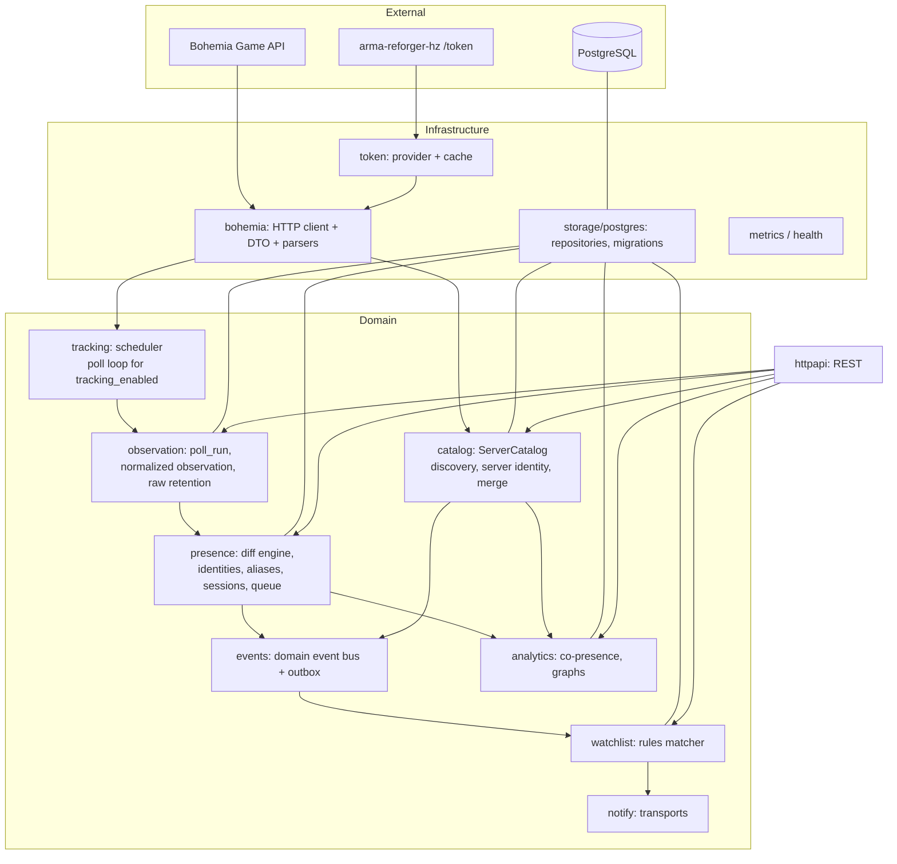

# ADR 0001 — Один Go-бинарник с внутренними модулями

**Статус:** Accepted · **Дата:** 2026-09-07

## Контекст

Нужен простой и надёжный сборщик данных (AGENTS.md §1, §20, §23). Нагрузка на старте: 5–10 отслеживаемых серверов, poll раз в минуту, один полный скан лобби в сутки. Микросервисы, брокеры и распределённость не оправданы.

## Решение

Один процесс `observer` с модулями, разделёнными по bounded context. Модули общаются через Go-интерфейсы и in-process доменные события (см. ADR 0007). Общая БД, но каждая таблица принадлежит ровно одному модулю.

Правила зависимостей:

- `bohemia`, `token`, `storage` ничего не знают о домене.
- `presence` не знает о `watchlist` и `notify` — только публикует события.
- `notify` не знает, откуда пришло событие.
- `httpapi` только читает и вызывает use-case'ы модулей, не содержит логики.
- Запрещены циклы между доменными модулями; проверяется линтером (`depguard` или `go-arch-lint`).

## Последствия

- Легко тестировать модули изолированно через интерфейсы.
- Если когда-нибудь понадобится вынести модуль в отдельный сервис, граница уже есть.
- Все фоновые циклы живут в одном процессе: нужен аккуратный lifecycle (`context`, `errgroup`, graceful shutdown).
