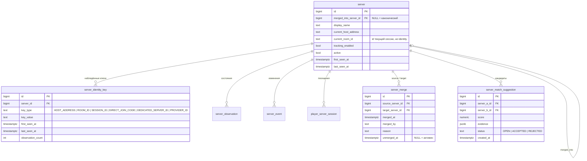
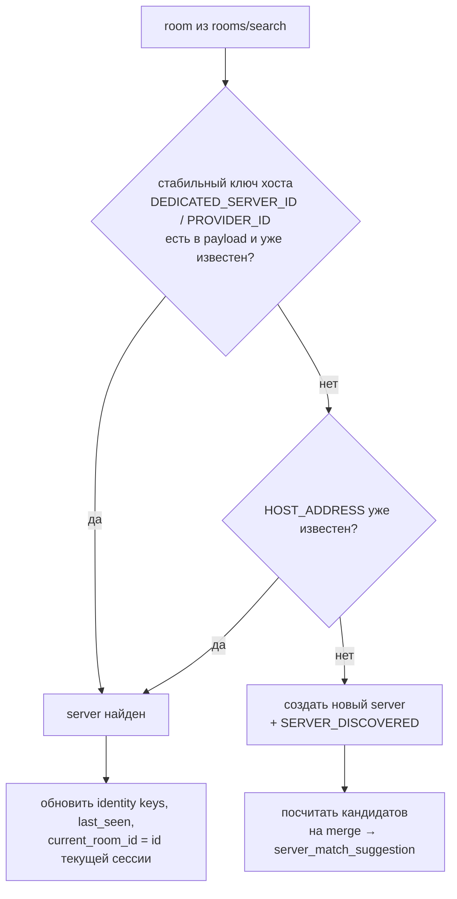

# ADR 0004 — Логическая идентичность сервера и merge истории

**Статус:** Proposed · **Дата:** 2026-09-07

## Контекст

Ручная проверка владельца проекта: `roomId` выдаётся заново при каждой регистрации сервера в лобби (в частности после рестарта). Это будет перепроверено отдельным экспериментом, но проектируем исходя из того, что **roomId — идентификатор игровой сессии, а не сервера**.

Сервер как объект наблюдения может:

- переехать на другой `hostAddress`, сохранив имя;
- сменить имя, сохранив адрес;
- сменить сценарий, моды, лимит игроков, directJoinCode;
- исчезнуть на дни и вернуться.

Ценность проекта — многолетняя история посещений. Её нельзя рвать при переезде, но и нельзя автоматически склеивать разные серверы по совпадению имени.

## Решение

### 1. Три уровня сущностей

- **`server`** — логический сервер, к которому привязана история. Каноническим считается запись с `merged_into_server_id IS NULL`.
- **`server_identity_key`** — все наблюдённые внешние ключи с интервалами жизни. Отвечает на вопрос «какие адреса/roomId/коды когда-либо принадлежали серверу».
- **`server_merge`** — журнал операций схлопывания, обратимый.

### 2. Резолюция room → server при наблюдении

`roomId` — идентификатор **текущей игровой сессии** сервера в лобби, а не сервера. Мы получаем его как результат поиска (например, по `hostAddress`) и используем только как параметр для `listPlayers`. В резолюции идентичности он не участвует; в `server_identity_key` он записывается лишь как история («какие сессии были у сервера»).

Приоритет ключей сверху вниз. Какие поля из `rooms/search` реально стабильны (`hostAddress`, скрытые id провайдера/dedicated server) — предмет отдельного исследования (AGENTS.md §26.3); список `key_type` расширяемый, приоритеты конфигурируемы.

Для tracking-цикла сервер ищется по `current_host_address` → получаем актуальный `roomId` → `listPlayers(roomId)`. При `ROOM_NOT_FOUND` **не** переключаемся автоматически на другой адрес, а фиксируем poll_run с ошибкой и даём match-подсказку.

### 3. Мягкий merge

- Исторические строки (`server_observation`, `player_server_session`, `server_event`) **никогда не переписываются**: `server_id` остаётся указывать на исходную запись.
- Merge = проставить `source.merged_into_server_id = target.id`, перенести `tracking_enabled` на target, записать `server_merge`. Цепочки не допускаются: при merge в уже слитый сервер указатель ставится сразу на канонический.
- Все чтения (API, аналитика, watchlist по серверу) идут через функцию/представление `canonical_server_id(server_id)`.
- Unmerge = `unmerged_at` + обнулить указатель. История автоматически «расклеивается».
- Merge и unmerge — ручные операции через API/админку. Автоматический merge на MVP запрещён.

### 4. Признаки «вероятно тот же сервер» (решить позже)

Кандидаты для `server_match_suggestion.evidence`, порядок — по ожидаемой силе:

1. пересечение состава игроков: доля игроков нового сервера, которых видели на старом за последние N дней (Jaccard / overlap coefficient);
2. временная смежность: старый исчез ≈ когда появился новый;
3. совпадение `directJoinCode`, если он переживает переезд;
4. совпадение имени + сценария + набора модов + `playerCountLimit`;
5. совпадение только имени — слабый признак, сам по себе недостаточен.

Формулы, пороги и веса **не фиксируются** до появления реальных данных каталога.

## Последствия

- Одинокая запись сервера без истории — нормальное состояние; связывать её с прошлым будет оператор по подсказке.
- Индексы: `server_identity_key(key_type, key_value)` для быстрой резолюции; уникальность на активный HOST_ADDRESS не вводим до подтверждения данными.
- Все запросы аналитики обязаны учитывать canonical id — это должно быть в одном месте (SQL-функция или репозиторий), а не размазано по коду.

## Открытые вопросы

- Подтвердить экспериментом, что `roomId` меняется при перерегистрации (снять до/после рестарта известного сервера).
- Есть ли в payload `rooms/search` стабильный id хоста (dedicated server id / provider id).
- Стабильность `directJoinCode` и `sessionId`.
