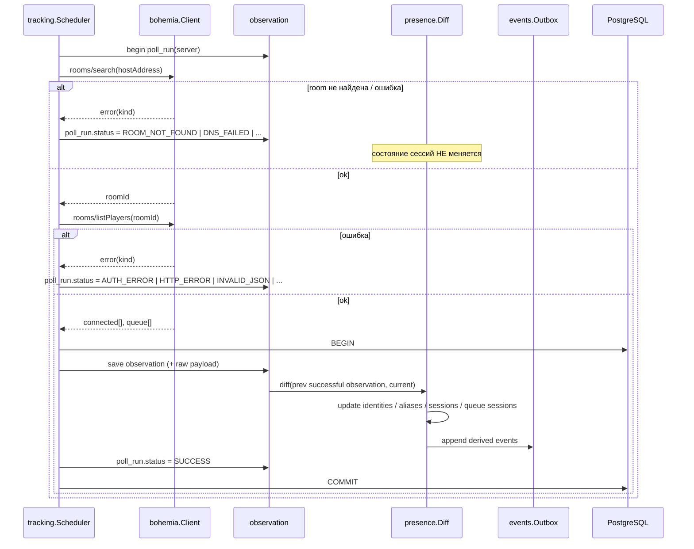
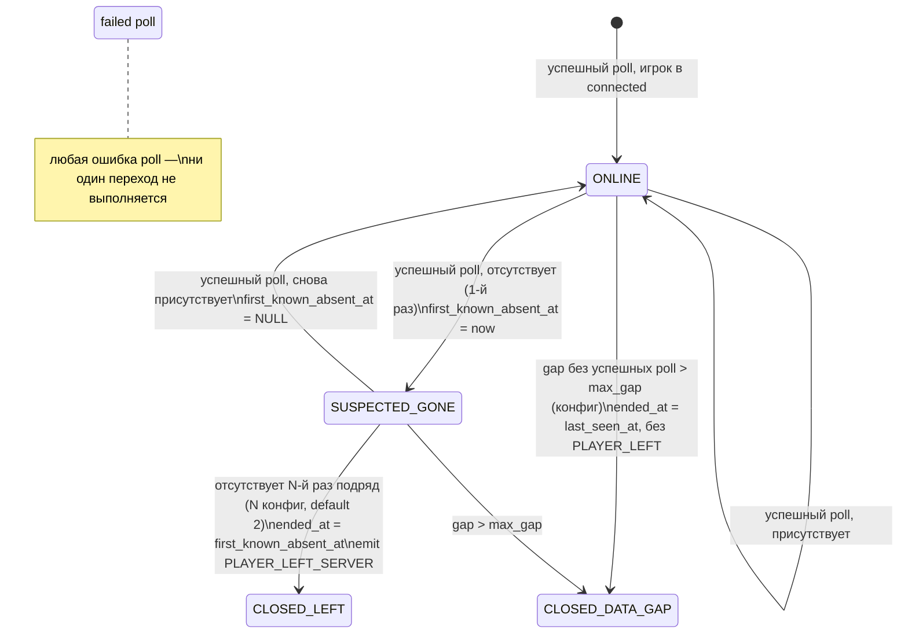

# ADR 0005 — Observation → Diff → Derived events; семантика неудачного poll

**Статус:** Accepted · **Дата:** 2026-09-07

## Контекст

Bohemia отдаёт факты наблюдения дискретно. Сеть, токен и сам backend ненадёжны. Фундаментальное правило (AGENTS.md §2.5, §10): **«мы перестали получать данные» ≠ «игрок вышел»**.

## Решение

### Конвейер одного poll

Один poll = одна транзакция. Если упало на середине — ни observation, ни события не сохраняются, следующий poll сравнит с предыдущим успешным.

### Классификация ошибок

Клиент `bohemia` возвращает типизированную ошибку с `Kind` из фиксированного списка (`DNS_FAILED`, `CONNECTION_TIMEOUT`, `TLS_ERROR`, `AUTH_ERROR`, `HTTP_ERROR`, `BOHEMIA_ERROR`, `INVALID_JSON`, `INVALID_RESPONSE`, `ROOM_NOT_FOUND`, `TOKEN_UNAVAILABLE`). `AUTH_ERROR` дополнительно инвалидирует кэш токена.

### Состояние presence-сессии

- `last_seen_at` — последний успешный poll с присутствием. `first_known_absent_at` — первый успешный poll с отсутствием. Между ними — интервал неопределённости, он хранится, а не угадывается.
- После большого разрыва данных (`CLOSED_DATA_GAP`) при возврате игрока открывается новая сессия, событие `PLAYER_JOINED_SERVER` помечается `after_data_gap = true`, чтобы watchlist мог решить, уведомлять ли.
- При старте процесса первый успешный poll — это **replay**: все присутствующие получают сессии, но события не эмитятся (или эмитятся с флагом `startup_replay = true`).

### Queue-сессии

Аналогичный автомат для `queuePlayers`. `result = JOINED_SERVER` выставляется, если игрок исчез из queue и появился в connected в пределах `queue_join_window` (конфиг) и без data gap между наблюдениями. Иначе `LEFT_QUEUE` или `UNKNOWN`.

### Observed vs derived

| Observed (факт) | Derived (вывод) |
|---|---|
| `server_observation`, `raw_payload` | `server_event` |
| присутствие игрока в observation | `player_server_session`, `PLAYER_JOINED/LEFT_SERVER` |
| `username` в observation | `player_alias`, `PLAYER_NICKNAME_CHANGED` |
| `queuePlayers` | `player_queue_session.result` |

Наблюдения не редактируются; выводы можно пересчитать заново из наблюдений (пока живы raw payload'ы).

## Последствия

- Frontend всегда может показать «данные не обновлялись N минут» из `poll_run`.
- Пороги `absent_confirmations`, `max_gap`, `queue_join_window`, `poll_interval` — конфигурация, не константы.
- Тесты diff engine — табличные, на последовательностях observation без сети.
