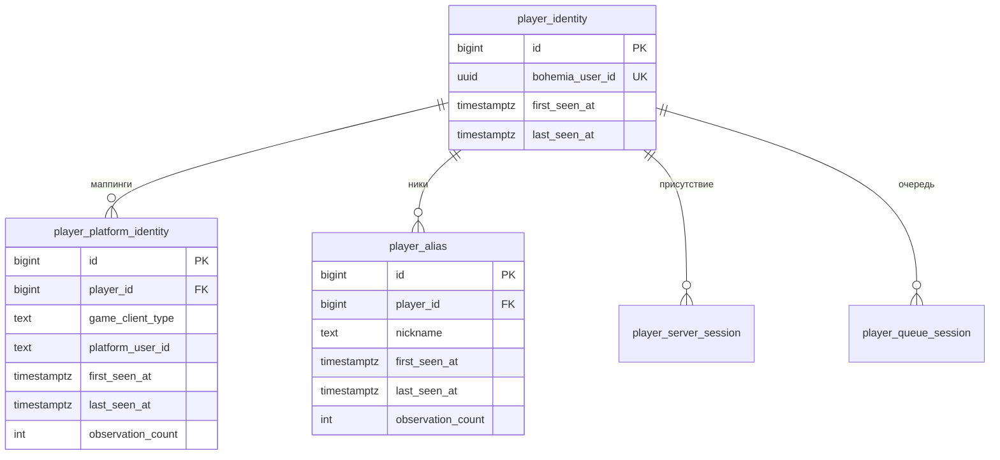

# ADR 0006 — Идентичность игрока

**Статус:** Accepted · **Дата:** 2026-09-07

## Контекст

`listPlayers` отдаёт `userId` (Bohemia), `username`, `gameClientType`, `platformUserId` (для PC ≈ SteamID64). Ник изменяем и не уникален. Связь Bohemia userId ↔ platformUserId не доказана как 1:1 (AGENTS.md §5).

## Решение

- Единственный UNIQUE — `player_identity.bohemia_user_id`.
- `player_platform_identity` уникален по `(player_id, game_client_type, platform_user_id)`, **не** по `platform_user_id` глобально. Аномалии «один SteamID у двух userId» сохраняются и видны в отчёте, а не отвергаются constraint'ом.
- `player_alias` уникален по `(player_id, nickname)`; при каждом наблюдении обновляются `last_seen_at`, `observation_count`. Смена текущего ника — derived-событие `PLAYER_NICKNAME_CHANGED`, только если новый ник наблюдался в `M` подряд успешных poll (конфиг, default 1 для MVP).
- **SteamID.** Для `gameClientType = PLATFORM_PC` поле `platformUserId` из `listPlayers` — это SteamID64. Он сохраняется как `player_platform_identity.platform_user_id` при каждом наблюдении. Не делаем его колонкой в `player_identity`, потому что связь 1:1 с Bohemia userId не доказана и потому что маппинг может меняться со временем.
- Индекс `(game_client_type, platform_user_id)` **без** уникальности — для поиска «какие player_id видели с этим SteamID». Отчёт «один SteamID у нескольких Bohemia userId» — штатный запрос по этому индексу; такого быть не должно, но если случится, данные сохранятся, а не отбросятся.
- SteamID — точка будущих интеграций со Steam (профиль, аватар, публичная статистика). Такое обогащение — отдельный модуль, читающий `player_platform_identity`, не часть collector.
- Никакого автоматического объединения `player_identity` между собой. Если позже понадобится — отдельный ADR по аналогии с merge серверов (ADR 0004).

## Последствия

- Ответы «какие ники были у игрока» и «кто использовал этот ник» — простые запросы по `player_alias`.
- Внутренний `player.id` используется во всех FK; внешние id — только атрибуты.
