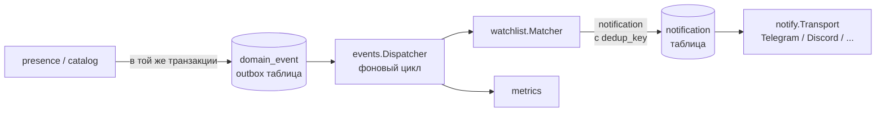

# ADR 0007 — In-process доменные события и outbox

**Статус:** Proposed · **Дата:** 2026-09-07

## Контекст

`presence` и `catalog` порождают события (`PLAYER_JOINED_SERVER`, `SERVER_DISAPPEARED`, …). Их потребители — watchlist, метрики, в будущем аналитика. Брокеры сообщений исключены (ADR 0001). Нужна идемпотентность и защита от повторных уведомлений (AGENTS.md §15).

## Решение

- События пишутся в таблицу `domain_event` **в той же транзакции**, что и вызвавшее их изменение. Поля: `id`, `event_type`, `occurred_at`, `player_id`, `server_id`, `session_id`, `payload jsonb`, `flags` (`startup_replay`, `after_data_gap`), `processed_at`.
- Диспетчер читает необработанные события по порядку `id`, вызывает подписчиков, отмечает `processed_at`. Подписчик обязан быть идемпотентным.
- Watchlist создаёт `notification` с `dedup_key = rule_id + session_id + event_type`; уникальный индекс гарантирует одну доставку на факт. Транспорт ретраит доставку по `notification.status`.
- События с `startup_replay = true` не порождают уведомлений. События с `after_data_gap = true` — по настройке правила.
- Событие — это derived-факт для истории: `domain_event` не чистится вместе с raw payload.

## Последствия

- Перезапуск процесса не теряет события и не дублирует уведомления.
- Никакого Kafka/Redis; при росте нагрузки достаточно индекса по `processed_at IS NULL`.
- Обработка событий отвязана от poll-цикла: медленный Telegram не задерживает сбор данных.
